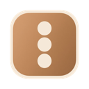
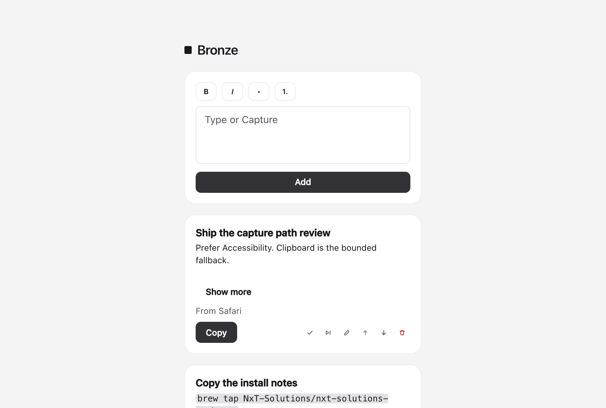
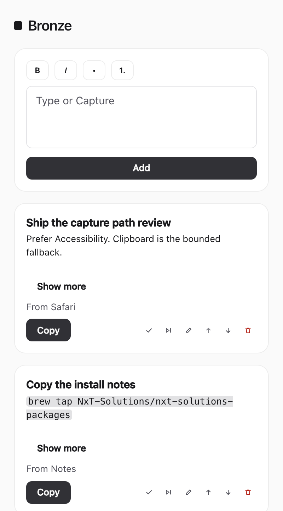
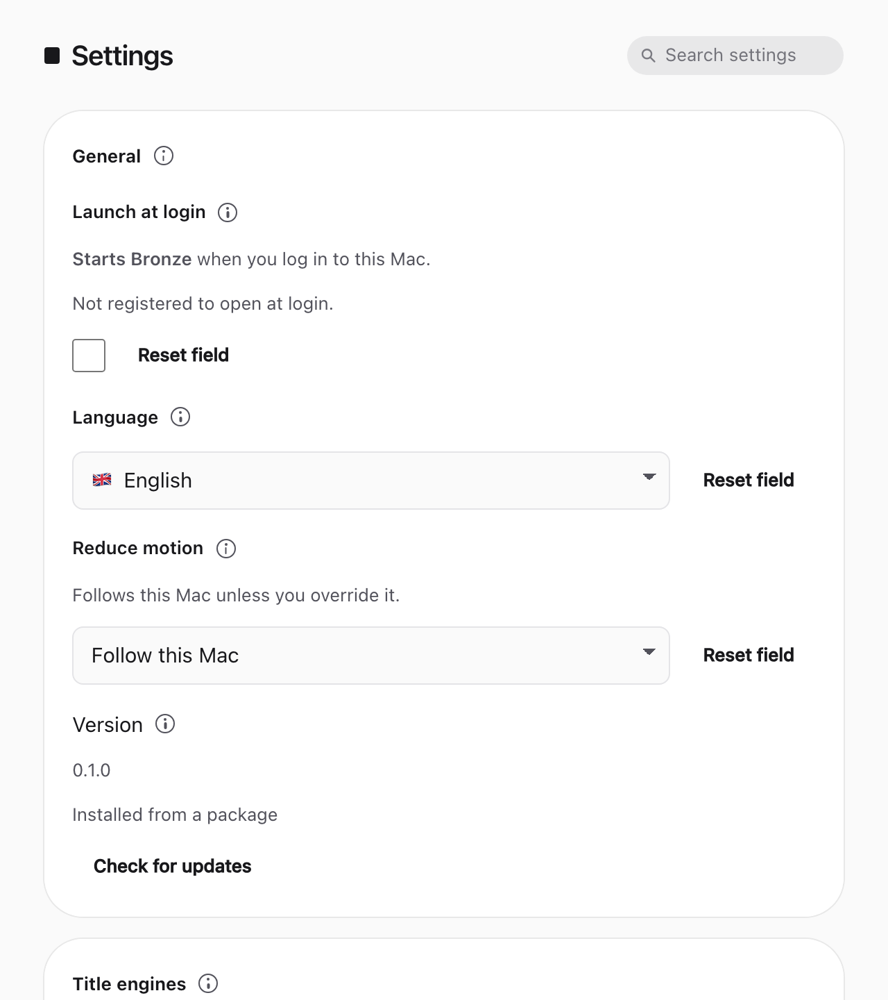

<p align="center">
  
</p>

<h1 align="center">Bronze</h1>

<p align="center">
  <strong>Capture what matters, queue it locally, send it back.</strong>
</p>

<p align="center">
  <a href="https://github.com/NxT-Solutions/Bronze/actions/workflows/ci.yml"></a>
  <a href="LICENSE"></a>
  <a href="https://github.com/NxT-Solutions/Bronze/releases"></a>
</p>

<p align="center">
  Local-first macOS selection-to-action queue. No account. No telemetry. No hosted AI by default.
</p>

<p align="center">
  
</p>

Bronze sits beside the app you are already in. Capture the selection, order the work, copy it back. It is not a clipboard recorder, a task manager, a note vault, or an AI client.

<p align="center">
  
  &nbsp;
  
</p>

## Install

macOS 14 (Sonoma) or later, Apple Silicon and Intel. Homebrew 7 refuses the cask until the tap is trusted.

```bash
brew tap NxT-Solutions/nxt-solutions-packages
brew trust nxt-solutions/nxt-solutions-packages
brew install --cask bronze
brew upgrade --cask bronze
```

Or download `bronze-macos-arm64.pkg` or `bronze-macos-x86_64.pkg` from [Releases](https://github.com/NxT-Solutions/Bronze/releases). Settings shows the running version. **Check for updates** is a button (ADR-023 Proposed). Homebrew installs copy `brew upgrade --cask bronze`. A package install opens the GitHub release.

The cask appears after the first published `.pkg`. Until then, use the GitHub asset. Unsigned packages are not a notarization claim.

## Highlights

- **Capture** selected text from the frontmost app (Accessibility first, bounded clipboard fallback)
- **Queue** items locally in SQLite, with copy, complete, skip, and trash
- **Copy** writes a pasteboard payload you can drop into any app
- **On this Mac** title engines, plus optional loopback Ollama or opt-in hosted keys
- **Offline by default** — no account, analytics, or remote fonts

## Develop

The native app is macOS-only (macOS 14 or later). Ubuntu CI runs the portable Rust crates and leaves `bronze-desktop` out.

Pins match CI: Node 24.21.0 (`package.json` `engines` and `.github/workflows/ci.yml`), pnpm 12.4.2 (`package.json` `packageManager`), rustc 1.98.1 (`rust-toolchain.toml`). Swift tools 6.0 is declared in `native/macos/BronzeNative/Package.swift`. Do not use Corepack.

### First time

1. Install the Xcode app so Swift 6 and the Apple SDKs are available. `native/macos/BronzeNative/Package.swift` declares `// swift-tools-version: 6.0`. The desktop build links `libBronzeNative.a` from that package.

```bash
xcode-select -p
swift --version
```

`swift --version` reports Swift 6.

2. Install rustup. From this clone, `rust-toolchain.toml` selects 1.98.1:

```bash
rustup show
```

3. Install Node 24.21.0, then pnpm. Do not use Corepack.

```bash
node -v
npm install -g pnpm@12.4.2
pnpm -v
```

`node -v` prints `v24.21.0`. `pnpm -v` prints `12.4.2`.

4. CMake builds `llama-cpp-sys-2` for the on-this-Mac title engine. The macOS CI job installs CMake when it is missing. The release workflow sets the macOS 14 deployment target for that CMake build. Export the same variables in the shell you use for `tauri dev` and `pnpm verify`. Swift already links with `arm64-apple-macosx14.0` or `x86_64-apple-macosx14.0` from `apps/desktop/src-tauri/build.rs`.

```bash
cmake --version || brew install cmake
export MACOSX_DEPLOYMENT_TARGET=14.0
export CMAKE_OSX_DEPLOYMENT_TARGET=14.0
```

5. Clone and install JavaScript dependencies.

```bash
git clone https://github.com/NxT-Solutions/Bronze.git
cd Bronze
pnpm install
```

6. Run the desktop app. Hand-test only in the native window. Opening the HTML files in a browser has no Tauri invoke.

```bash
pnpm --filter desktop tauri dev
```

7. Maintainer bar: Biome, workspace lint, typecheck, tests, validate, `cargo fmt`, Clippy, `cargo test`, and `python3 tooling/planning-checks.py`.

```bash
pnpm verify
```

A local debug package (unsigned) is `tooling/package-debug.sh`. Pull requests run the [CI](.github/workflows/ci.yml) quality jobs. CI does not notarize.

8. Build the GitNexus index from the repo root. GitNexus is contributor tooling outside the Bronze app. The index stays on this machine. This repo pins pnpm, and Node 24's npm can crash `npx` while installing GitNexus, so the rebuild command is:

```bash
pnpm --allow-build=@ladybugdb/core --allow-build=gitnexus --allow-build=tree-sitter dlx gitnexus@latest analyze
```

Run that again after every fresh clone. It writes `.gitnexus/` (LadybugDB graph, parse cache, and the local runner). `.gitnexusrc` sets `defaultBranch` to `main` and `skipContextFiles`, so analyze leaves `AGENTS.md` and `CLAUDE.md` in place. Embeddings stay off, so analyze does not download a model. GitNexus is not a dependency of the Bronze app, and the app does not read the index.

Committed, so every clone matches:

| Path | What it is |
| --- | --- |
| `.gitnexusrc` | Index defaults for this repo |
| `.cursor/mcp.json`, `.mcp.json`, `.codex/config.toml`, `opencode.json`, `.grok/config.toml`, `.factory/mcp.json` | Shared editor MCP config |
| `.gitignore` | Rules for the generated index and local secrets |

Gitignored, rebuilt or created on each machine:

| Path | What it is |
| --- | --- |
| `.gitnexus/` | Generated index, LadybugDB graph, parse cache, local runner |
| `.env`, `.env.*` | Secrets, including a GitNexus eval-server token. `.env.example` stays trackable |

9. Cursor loads the committed `.cursor/mcp.json`. Enable GitNexus once under Cursor Settings → MCP. That approval stays on this machine.

Committed MCP entries start the same server, `npx -y gitnexus@latest mcp` (OpenCode passes that as a local command array):

| Editor | File |
| --- | --- |
| Cursor | `.cursor/mcp.json` |
| Claude Code | `.mcp.json` |
| Codex | `.codex/config.toml` |
| OpenCode | `opencode.json` |
| Grok | `.grok/config.toml` |
| Factory Droid | `.factory/mcp.json` |

Claude Code asks once to trust `.mcp.json`. Codex and Grok read the project file after the repo is trusted.

Antigravity, CodeBuddy, Qoder, and Windsurf keep MCP in the home directory. `npx gitnexus setup` writes the GitNexus entries it knows. The server object is the same `mcpServers.gitnexus` block.

| Editor | Home file |
| --- | --- |
| Antigravity | `~/.gemini/antigravity/mcp_config.json` |
| CodeBuddy | `~/.codebuddy/.mcp.json` |
| Qoder | `~/.qoder.json` |
| Windsurf | `~/.codeium/windsurf/mcp_config.json` |

Claude Code and Codex hook scripts stay under the home directory (`npx gitnexus setup` installs them). The registry of indexed repos stays in `~/.gitnexus/`.

Permissions: Accessibility and Input Monitoring. Bronze never asks for Screen Recording.

## Quality

| Check | Where |
| --- | --- |
| Biome, typecheck, JS tests, i18n validate | `quality-js` |
| Planning-pack gates | `quality-docs` |
| `cargo fmt`, Clippy, portable crate tests | `quality-rust` |
| macOS Clippy and tests except `bronze-desktop` | `quality-macos` |
| Full workspace including Swift | `pnpm verify` on a Mac |

Do not claim WCAG, VoiceOver, or notarization without files in `docs/evidence/`.

## Contributing

See [CONTRIBUTING.md](CONTRIBUTING.md). Work lands through a pull request to `main`. Changelog: [CHANGELOG.md](CHANGELOG.md). Security: [SECURITY.md](SECURITY.md).

ADR-002 is Accepted (split arm64 and Intel packages; the operator asked for the Intel build). ADR-009, ADR-018, and ADR-023 stay Proposed unless a human accepts them.

## License

MIT. See [LICENSE](LICENSE). Copyright 2026 Noah Gillard.

## Planning pack

Requirement IDs in [docs/03-prd.md](docs/03-prd.md) and [docs/18-adrs.md](docs/18-adrs.md) remain authority.

1. [Executive summary](docs/00-executive-summary.md)
2. [Reference product and video analysis](docs/01-product-reference-analysis.md)
3. [Competitive landscape](docs/02-competitive-landscape.md)
4. [Product requirements document](docs/03-prd.md)
5. [Functional specification](docs/04-functional-spec.md)
6. [UX and interaction specification](docs/05-ux-ui-interaction-spec.md)
7. [System architecture](docs/06-system-architecture.md)
8. [macOS capture reliability](docs/07-macos-capture-reliability.md)
9. [Data model and portability](docs/08-data-model-and-portability.md)
10. [Security, privacy, and threat model](docs/09-security-privacy-threat-model.md)
11. [Accessibility conformance plan](docs/10-accessibility-conformance-plan.md)
12. [Internationalization](docs/11-i18n-localization.md)
13. [Settings and shortcuts](docs/12-settings-and-shortcuts.md)
14. [Testing, quality, and release](docs/13-testing-quality-release.md)
15. [Agentic implementation plan](docs/14-agentic-implementation-plan.md)
16. [Backlog and traceability](docs/15-backlog-traceability.md)
17. [Cooper OSS audit](docs/16-cooper-oss-audit.md)
18. [Agent-skill recommendations](docs/17-agent-skills-recommendations.md)
19. [Architecture decisions](docs/18-adrs.md)
20. [Sources and evidence](docs/19-sources.md)
21. [Implementation bootstrap](docs/20-implementation-bootstrap.md)
22. [Pre-implementation reconciliation](docs/21-preimplementation-reconciliation.md)
23. [bmad-loop policy](docs/22-bmad-loop-policy.md)

Implementation agents: [AGENTS.md](AGENTS.md). Local run notes and the long hand-test list live in [docs/20-implementation-bootstrap.md](docs/20-implementation-bootstrap.md) and the git history of this file. Visual direction: [assets/bronze-ui-concept.png](assets/bronze-ui-concept.png) (inspiration only). Asset provenance: [assets/README.md](assets/README.md).
