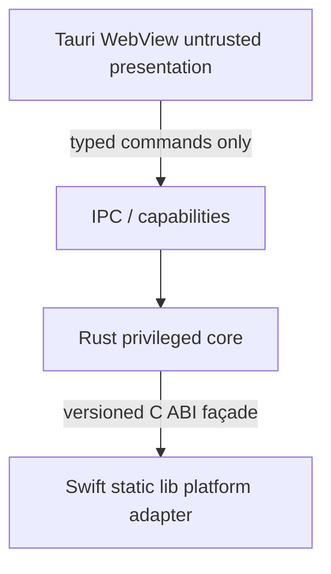

# Architecture Spine — Bronze

## Design Paradigm

Hexagonal / ports-adapters. WebView is untrusted presentation. Rust is the privileged core. Swift is an in-process static-library platform adapter. There is no JS→Swift path.

| Layer | Lives in |
| --- | --- |
| Presentation | `apps/desktop` WebView, `packages/ui`, `packages/i18n` |
| Application ports | `bronze-domain`, `bronze-capture`, `bronze-settings`, `bronze-storage`, `bronze-diagnostics`, `bronze-platform` |
| Driving adapters | `apps/desktop/src-tauri` IPC/capabilities; `packages/contracts` |
| Driven adapters | `bronze-platform-macos`, `native/macos/BronzeNative`; SQLite via `bronze-storage` |

React invokes typed Rust commands only. Rust alone crosses the native ABI.

## Invariants & Rules

IDs match Bronze ADR-001..ADR-017. Proposed ADR-002, ADR-009, and ADR-018 are not adopted.

### AD-001 — ADR-001 Local selection-to-action queue [ADOPTED]

- **Binds:** G-05, SEC-004, all P0
- **Prevents:** screen/audio/video recording; passive clipboard history; account, sync, hosted AI, analytics, telemetry; Windows/Linux/Mac App Store v1
- **Rule:** v1 is selected text or manual note → ordered local queue → deterministic copy → explicit lifecycle. No ScreenCaptureKit, AVFoundation, VideoToolbox, or Screen Recording / microphone / camera permission.

### AD-003 — ADR-003 Tauri, React, TypeScript, Rust, pnpm, Turborepo [ADOPTED]

- **Binds:** all P0
- **Prevents:** Electron; pure web/PWA; Next.js runtime; product behavior in `packages/ui`; native framework imports outside the macOS adapter
- **Rule:** Tauri 2 WKWebView shell; React/TypeScript UI; Rust workspace owns domain, capture coordinator, storage, validation, diagnostics, and Tauri commands; pnpm + Turborepo for JS; Biome / rustfmt / Clippy / SwiftPM / swift-format. Shared TypeScript contracts derive from or are checked against Rust DTOs. Signing, notarization, and TCC tests never use Turbo cache.

### AD-004 — ADR-004 In-process Swift native bridge [ADOPTED]

- **Binds:** CAP-001 through CAP-010, WIN-001 through WIN-004
- **Prevents:** Swift sidecar/helper; JavaScript native plugin; Swift domain/SQL/queue ownership; event-tap callback doing AX, UI, IPC, database, allocation-heavy, or logging work
- **Rule:** Build BronzeNative as a static library linked into the Tauri executable. `bronze-platform-macos` is the safe Rust façade. Versioned C ABI, explicit buffer ownership, one-shot callbacks, fixed-width types, no unwind across the boundary. React never calls Swift.

### AD-005 — ADR-005 Standard chord plus passive modifier event tap [ADOPTED]

- **Binds:** CAP-001 through CAP-004, A11Y-001, SET-002
- **Prevents:** keylogger-style capture; suppressing or mutating the key stream; modifier polling; NSEvent monitor as sole engine; IOHID interception; timed gesture as the only workflow
- **Rule:** Registered global chord is the standard route. Status menu and manual composer always exist. Optional double tap uses a session `CGEventTap` with `listenOnly`, observing `flagsChanged` and, when robust cancellation is enabled, `keyDown` reduced to a non-Shift cancel signal. Trigger on second valid modifier release. Double tap is disabled by default.

### AD-006 — ADR-006 AX-first selection with bounded clipboard fallback [ADOPTED]

- **Binds:** CAP-005 through CAP-009
- **Prevents:** clipboard-first capture; automatic pasteboard restoration; querying protected or unknown-protection controls; silent trim, normalize, translate, or encode mutation
- **Rule:** Provider chain is exclusion → AX selected text / range → optional user-enabled synthetic copy for a stable bundle ID after shared-clipboard disclosure → explicit Create from Clipboard → manual composer. P0 synthetic copy writes nothing after the copy and does not restore prior clipboard. Fail closed on unknown protection.

### AD-007 — ADR-007 Activating utility window and native status menu [ADOPTED]

- **Binds:** WIN-001 through WIN-005, A11Y-001 through A11Y-005
- **Prevents:** nonactivating NSPanel as primary editor; transparent click-through overlay; menu-only UI; showing the panel before the capture-target snapshot; storing RTL-relative panel edge
- **Rule:** Warm hidden Tauri WebviewWindow that can become key. Snapshot capture target and selection before showing it. One native accessible status item. Accessory / Dockless default. Persist physical `left` / `right` / `top` edge. Escape/hide restores prior focus where safe. Blur-hide must not discard an unsaved draft.

### AD-008 — ADR-008 Rust-owned SQLite and deterministic portable export [ADOPTED]

- **Binds:** DAT-001 through DAT-004, QUE-001 through QUE-008
- **Prevents:** WebView SQL; browser storage or JSON as canonical store; silent destructive reset; marking lifecycle before the corresponding side effect succeeds
- **Rule:** SQLite WAL with foreign keys; one serialized writer; Rust repository is the sole SQL owner; versioned checksummed migrations; integrity check and backup before migration/restore; FTS5; tombstone/trash and command/inverse undo journal; deterministic versioned JSON archive plus Markdown export; atomic staged import/restore. DAT-004 is logical deletion/recovery, not forensic erasure. Copy order is deterministic output → successful pasteboard write → DB lifecycle/receipt.

### AD-010 — ADR-010 Least-privilege Tauri IPC and CSP [ADOPTED]

- **Binds:** SEC-001 through SEC-003
- **Prevents:** shell, raw filesystem, raw SQL, HTTP, WebSocket, upload, unrestricted opener, remote-origin IPC; raw AX / event-tap / pasteboard APIs in WebView; global broadcast of captured content
- **Rule:** WebView is untrusted presentation. Rust validates window label, capability, payload, length, enum, ID, revision, and state. Separate capabilities for quick, library, settings, and onboarding. Strict CSP: packaged self assets and exact required Tauri IPC only; no eval, frames, objects, or remote assets. Release DevTools and navigation disabled. File dialogs and resolved paths stay native/Rust-owned.

### AD-011 — ADR-011 Developer ID distribution without App Sandbox [ADOPTED]

- **Binds:** SEC-005, v1 constraints
- **Prevents:** `com.apple.security.app-sandbox` in v1; Mac App Store v1; release `get-task-allow`, JIT, unsigned executable memory, or disabled library validation
- **Rule:** Developer ID Application signing, Hardened Runtime, minimal entitlements, notarytool + staple + Gatekeeper verify. Stable bundle ID, Team ID, and designated requirement. Sign nested content inside-out. Ad-hoc signatures are development only.

### AD-012 — ADR-012 shadcn React Aria base [ADOPTED]

- **Binds:** A11Y-001 through A11Y-006
- **Prevents:** mixed primitive bases without a component-level ADR; P0 `contenteditable`; virtualized core list; drag without a button/menu alternative; clickable `div` controls
- **Rule:** Initialize owned shadcn components with the React Aria base. Use semantic native HTML where simpler. Generated source is owned, reviewed, and tested. Keep visible focus or an equal `:focus-visible` replacement.

### AD-013 — ADR-013 WCAG 2.2 AA plus EN 301 549 evidence model [ADOPTED]

- **Binds:** G-04, A11Y-001 through A11Y-006
- **Prevents:** shipping an unscoped “WCAG proof” or “fully accessible” claim; treating axe/Biome results as conformance
- **Rule:** WebView target is WCAG 2.2 AA. Whole-app target is EN 301 549 V3.2.1 clauses 5, 11, and 12 as applicable. Public conformance claims require a criterion matrix, platform AT evidence, and independent audit. Double-modifier gesture is an enhancement; every core operation has a non-timed route.

### AD-014 — ADR-014 BCP 47 and ICU internationalization [ADOPTED]

- **Binds:** G-06, I18N-001 through I18N-004
- **Prevents:** hard-coded user-facing strings; sentence concatenation; silent language detection; UI locale leaking onto captured text
- **Rule:** Canonical BCP 47 tags with RFC 4647-style progressive fallback preserving script/variant before language, then English. react-i18next/i18next behind a Bronze adapter with ICU MessageFormat. Stable semantic message IDs. UTC storage and locale-neutral enums. Per-item `content_language` is canonical BCP 47 or `und`, default `und`. Native menus and InfoPlist share the same glossary. Build fails on missing keys or placeholder mismatch.

### AD-015 — ADR-015 Content-free diagnostics [ADOPTED]

- **Binds:** CAP-010, SEC-006, SUP-002
- **Prevents:** selected, item, or clipboard text; key stream; titles; URLs; AX trees; user paths; SQL bound values in diagnostics; diagnostic write failure rolling back a saved item
- **Rule:** Diagnostics may hold request/diagnostic IDs, timestamps, stage durations, trigger/provider/result enums, permission snapshot, build/schema version, policy-gated bundle ID, and health counters. Support bundle is generated locally, fully previewed, and exported only after consent. Redaction is at the type/schema boundary. Coordinator keeps bounded in-memory terminal status if diagnostic persistence fails.

### AD-016 — ADR-016 Semantic configurable-shortcut schema [ADOPTED]

- **Binds:** CAP-001, CAP-002, SET-001, SET-002, I18N-004
- **Prevents:** opaque string accelerators as the store; disabling chord, status menu, and manual route together; persisting a failed registration
- **Rule:** Store a versioned semantic shortcut (action, trigger form, modifiers and optional side, physical or logical key, double-tap thresholds, enabled, schema/revision). Registration is transactional: validate, try register, optional user-ended test, persist, unregister old; failure retains the old shortcut. UI shows platform glyph plus localized spoken text.

### AD-017 — ADR-017 Packaged local UI and zero runtime network [ADOPTED]

- **Binds:** SEC-001, SEC-004, G-05
- **Prevents:** remote fonts, images, embeds, iframes, analytics, crash upload, AI API, account endpoint, or update-check client in the production-default feature set
- **Rule:** Bundle all scripts, styles, fonts, icons, and locale data. No HTTP/WebSocket/upload client in production-default. External help/source links open in the default browser only after allowlist/confirmation; never render inside the privileged WebView. Future network requires a superseding ADR, explicit opt-in, visible destination/payload class, and threat-model update.



Dependency direction is a rule: WebView → IPC → Rust → Swift. No reverse. No JS→Swift.

## Consistency Conventions

| Concern | Convention |
| --- | --- |
| Naming | Crates `bronze-*`; native package `BronzeNative`; opaque lowercase UUIDv7/ULID IDs generated in Rust; stable semantic i18n message IDs; shortcuts keyed by `ShortcutActionId` |
| Data and formats | UTC millisecond timestamps; locale-neutral closed enums; command envelope is command ID + actor window + entity ID + expected revision + validated payload; diagnostics content-free; export UTF-8 LF, sorted keys, RFC 3339 UTC, no machine paths |
| Closed enums | Item lifecycle `queued` / `copied` / `active` / `done` / `skipped` / `trashed`. Section `active` / `archived` / `trashed`. Capture terminal `saved` / `rejected` / `failed` / `cancelled`. Permission `unknown` / `not_requested` / `denied` / `granted_unverified` / `healthy` / `degraded` / `unavailable` / `requires_relaunch`. Post-copy `unchanged` / `copied` / `active` / `done`. Advance `keep` / `nextQueued`. Clipboard fallback `manual` / `syntheticExperimental` / `off`. Panel mode `summon` / `pinned` / `autoHide`. Panel edge `left` / `right` / `top` / `lastPosition`. Backup schedule `daily` / `weekly` only. Content language canonical BCP 47 or `und` |
| State and threads | One serial capture coordinator; CGEventTap on a dedicated CFRunLoop thread; AX on a dedicated serial queue; AppKit on main; one SQLite writer; no callback holds UI/store/domain locks |
| Capture | Never silently drop a request. Every observed trigger gets an ID, exactly one terminal result, a local diagnostic stage, and accessible feedback. Ingress snapshot is immutable; no retarget to a later frontmost app |
| Copy and mutation | Output profile is the sole post-copy lifecycle/advance authority. Duplicate command ID inside the retry window reconstructs the prior result; older ID returns `idempotency_expired` and is never executed. P0 commits a supported capture before success feedback |
| Errors and logging | Typed result envelopes. Framework errors become safe enums. No user-content in logs |
| Config and auth | No account. Permission prompts only after a labeled Enable action. Granted does not mean healthy |
| UI strings | Every user-facing string lives in the locale catalog. Pseudo-locales and RTL are tested |
| Window chrome | Persist physical panel edge; RTL never mirrors stored side. UI chrome uses logical CSS |
| Filesystem | WebView never supplies raw paths. Rust validates capability, IPC schema, ownership, size, MIME, and canonical path |
| Release identity | Bundle ID / Team ID / designated requirement are functional dependencies for TCC continuity |

## Stack

Planning snapshot 2026-08-27 from `docs/20-implementation-bootstrap.md` and `research/technology-baseline.md`. Not a lockfile. Exact pins land when Milestone 1 scaffolding writes lockfiles.

| Name | Version |
| --- | --- |
| Node.js | 24.19.0 |
| pnpm host bootstrap | 11.9.0 |
| pnpm registry snapshot | 11.24.0 |
| rustc / cargo | 1.98.0 |
| rustup | 1.29.0 |
| Swift | 6.3.3 |
| Xcode | 26.6 (17F113) |
| Apple clang | 21.0.0 |
| @tauri-apps/cli | 2.11.4 |
| @tauri-apps/api | 2.11.1 |
| React | 19.2.8 |
| TypeScript | 7.0.2 |
| Biome | 2.5.10 |
| Turborepo | 2.10.12 |
| Vite | 8.2.2 |
| shadcn | 4.19.0 |
| Tailwind CSS | 4.3.3 |
| i18next | 26.4.0 |
| react-i18next | 17.0.12 |
| Zod | 4.4.3 |
| Vitest | 4.1.11 |
| axe-core | 4.13.0 |
| Testing Library React | 16.3.2 |
| uv | 0.12.6 |

## Structural Seed

```text
apps/
  desktop/
    src/                 # rendering, focus, local draft, accessible interaction
    src-tauri/
      capabilities/      # quick.json library.json settings.json onboarding.json
      src/               # commands, events, setup, main.rs
packages/
  ui/                    # owned shadcn components and tokens; no product state or IPC
  contracts/             # generated DTOs and error codes
  i18n/                  # catalogs, locale resolution, formatters
  test-support/
crates/
  bronze-domain/
  bronze-capture/
  bronze-storage/
  bronze-settings/
  bronze-diagnostics/
  bronze-platform/
  bronze-platform-macos/
native/
  macos/
    BronzeNative/
```

Deployment envelope: direct Developer ID download; Hardened Runtime; notarized; no App Sandbox v1; no runtime network in the production-default build; no updater until a superseding ADR. Local SQLite + WAL + backups; storage directory chosen by ADR-009 (still Proposed). macOS minimum and universal2 remain ADR-002.

## Capability → Architecture Map

| Capability / Area | Lives in | Governed by |
| --- | --- | --- |
| CAP-001 CAP-002 CAP-003 | `bronze-capture`, `bronze-settings`, `bronze-platform-macos`, BronzeNative | AD-004, AD-005, AD-016 |
| CAP-004 | `bronze-capture` | AD-004, AD-005, AD-006 |
| CAP-005 CAP-006 CAP-007 CAP-008 CAP-009 | `bronze-capture`, `bronze-platform-macos`, BronzeNative | AD-006 |
| CAP-010 | `bronze-diagnostics`, `bronze-capture` | AD-015 |
| QUE-001 QUE-002 QUE-003 QUE-004 QUE-005 QUE-006 QUE-008 | `bronze-domain`, `bronze-storage` | AD-008 |
| QUE-007 | `bronze-storage` | AD-008; tokenizer ADR-018 deferred |
| WIN-001 WIN-002 WIN-003 WIN-004 WIN-005 | `apps/desktop`, `bronze-platform-macos`, BronzeNative | AD-007, AD-010 |
| DAT-001 DAT-002 DAT-003 DAT-004 | `bronze-storage` | AD-008; container path ADR-009 deferred |
| SEC-001 SEC-002 SEC-003 | `apps/desktop/src-tauri` capabilities, Rust command validation | AD-010 |
| SEC-004 | all packages | AD-001, AD-017 |
| SEC-005 | signing / entitlements in `apps/desktop/src-tauri` | AD-011 |
| SEC-006 | `bronze-diagnostics` | AD-015 |

## Deferred

- **ADR-002** — macOS minimum and architecture range. Spike 0 / DG-01. No production OS or universal2 claim. Development may be arm64. Availability checks required. CI uses one central minimum placeholder.
- **ADR-009** — Protected App Group container versus Application Support. DATA-CONTAINER-01. Storage locator stays an interface; no crate or UI hard-codes the directory. Development may use Application Support.
- **ADR-018** — Locale-aware FTS tokenizer and search semantics. SEARCH-01 golden corpus required. QUE-007 and G-06 stay incomplete. Raw item body is unchanged; derived index may rebuild.
- **Lockfiles** — Exact JS/Rust crate pins and TypeScript 7 / Vite 8 compatibility confirmation wait for Milestone 1 scaffolding. The Stack table is a dated snapshot.
- **Human AT / signed TCC / notarization evidence** — required at release; not claimed by this spine.
